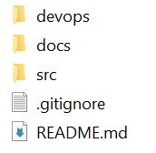
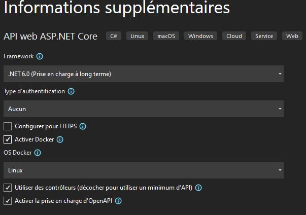

# Backend Skeleton.md

## Prerequisites

- VS 2022 Entreprise
- WSL 2
- Docker desktop with kubernetes support enabled.
- .NET 6 SDK

## Repertory structure

- In `<Project name>` repertory, here is the structure to follow : 

    
    
    `devops` contains yaml files for CI/CD.  
    `docs` contains all the documentation related to the service, the openapi yaml file(s) for example.  
    `src` contains the sources of the service.

## Project Template

- In `src` repertory and with the help of VS, add a new **ASP.NET Core Web API** project with the following parameters :  

    
- _(Optional)_ Once the project is created, right-click on the project name > Add > **Container orchestrator support** and choose Linux as OS. This will generate a docker-compose file.
- In project repertory,  run the following command ```dotnet new gitignore```. This will create a new .gitignore file configured for a .NET project structure.
- Initialize a new README file with the template provided [here](../README.md).

## Project code 

- Controller should return 
    ```
    ActionResult<IEnumerable<WeatherForecast>>
    <...>
    return Ok(...)
    ```
- Controllers will consumes and produces json. Enum should be serialized as string.
    ```
    builder.Services.AddControllers(options =>
    {
        options.OutputFormatters.RemoveType<StringOutputFormatter>();
        options.Filters.Add(new ProducesAttribute("application/json"));
        options.Filters.Add(new ConsumesAttribute("application/json"));
    }).AddJsonOptions(options =>
    {
        options.JsonSerializerOptions.Converters.Add(new JsonStringEnumConverter());
    });
    ```
- If an endpoint returns an error, the response should implement the problemDetails standard. To do so : 
    - Install `Hellang.Middleware.ProblemDetails` nuget package.
    - Add the following line in `Program.cs`
        ```
        builder.Services.AddProblemDetails();
        ```
- Enable **HealthChecks**. To do so,
    - first register the HealthCheck service.
        ```
        service.AddHealthChecks();
        ```
    - then add the healthcheck endpoint.
        ```
        app.MapHealthChecks("/health");
        ```
    For more info about Health checks in .NET, see [here](https://docs.microsoft.com/en-us/aspnet/core/host-and-deploy/health-checks?view=aspnetcore-6.0).

- Configure **Serilog** for logging. To do so,
    - Install _Serilog.AspNetCore_ nuget package from the Nuget Package Manager.
    - Add the following line in Program.cs class : 
        ```
            builder.Host.UseSerilog((ctx, lc) => lc.WriteTo.Console());
            <...>
            app.UseSerilogRequestLogging();
        ```
    For more info about Serilog, see [here](https://blog.datalust.co/using-serilog-in-net-6/).

- Configure **Swagger/OpenApi** documentation. To do so, 
    - Add the following lines in Program.cs class : 
        ```
            builder.Services.AddSwaggerGen(opt =>
            { 
                opt.SwaggerDoc("v1", new OpenApiInfo { Title = "Backend Skeleton", Version = "v1", Description = "Backend Skeleton openapi" });
                opt.IncludeXmlComments(Path.Combine(AppContext.BaseDirectory, $"{Assembly.GetExecutingAssembly().GetName().Name}.xml"));
            });
        ```
    For more info about Swagger/OpenAPI see [here](https://docs.microsoft.com/en-us/aspnet/core/tutorials/getting-started-with-swashbuckle?view=aspnetcore-6.0&tabs=visual-studio).
- Remove the following line : 
    ```
    app.UseAuthorization();
    ```

## Code quality analysis

- Add a new `.editorconfig` file by right-clicking on the project name > Add > New EditorConfig.
  
  For more info about editorconfig, see [here](https://docs.microsoft.com/en-us/visualstudio/ide/create-portable-custom-editor-options?view=vs-2022).

- Change the analysis level of the project by adding the following code in project .csproj file : 
    ```xml
    <AnalysisLevel>latest-Recommended</AnalysisLevel>
    ```
    and
    ```xml
    <PropertyGroup Condition="'$(Configuration)|$(Platform)'=='Debug|AnyCPU'">
        <TreatWarningsAsErrors>True</TreatWarningsAsErrors>
    </PropertyGroup>

    <PropertyGroup Condition="'$(Configuration)|$(Platform)'=='Release|AnyCPU'">
        <TreatWarningsAsErrors>True</TreatWarningsAsErrors>
    </PropertyGroup>
  ```

For more info about code analysis, see [here](https://docs.microsoft.com/en-us/dotnet/fundamentals/code-analysis/overview).

## Options handling

The settings the app needs to run are represented in `appsettings.json` and overrided for development in `appsettings.Development.json`.  
In .NET, these settings are bound to an instance of a POCO class in a dedicated `Options` repertory. To make the binding and validate the options, we create a generic extension class (in a dedicated `Extensions` repertory) like the following : 

```
using BackendSkeleton.Options;
using Microsoft.Extensions.Options;

namespace BackendSkeleton.Extensions
{
	public static class ServiceCollectionExtensions
	{
		public static OptionsBuilder<T> ConfigureApplicationOptions<T>(
		this IServiceCollection services, IConfigurationSection section) where T : class
		{
			return services
					   .AddOptions<T>()
					   .Bind(section)
					   .ValidateDataAnnotations()
					   .ValidateOnStart();
		}
	}
}
```

that we can use in `Program.cs` : 

```
builder.Services.ConfigureApplicationOptions<ApplicationOptions>(
	builder.Configuration.GetSection(ApplicationOptions.Application));
```

In a docker context, options can be passed as environment variables and must be declared in the `docker-compose.yml`. They can be overridden in a `docker-compose.override.yml` file. Variables can be directly set under the `environment` label or can be automatically read from a .env file with the pattern `env_variable=${variable_in_env_file}`.  

In `docker-compose.yml`, variable must have the same name than in appsettings.json in order for .NET to considers them as application options. If they are complex option objects (with one or multiple level of depths), use `__` pattern. For example in yml:

```yml
Application__ConnectionString=ConnectionStringValue
```

represents in json : 
```json
"Application":{
    "ConnectionString": "ConnectionStringValue"
}
```
Which can then be bound to an instance of the following C# class :

```
public class Application {
    public string ConnectionString { get; set; }
}
```
## Tests
1. Create a new solution folder named `Tests` in your project (Visual Studio).  
    Right-click on the solution > Add > New Solution Folder 
2. Create a new folder in "src" with the same name as the solution folder.
3. In the project, exclude the folder just created.  
    Right-click on the folder > Exclude From Project
4. In the new solution folder, create a new Test Project with .NET 6.0 Framework   
    Right-click on the solution folder > New Project... > MSTest Test Project > Next >    Project name : `TestName.UnitTests`   
    Location : _Browse in the project and select the added folder in 'src'_
5. For Unit tests, add `Moq` and `NFluent` packages in the project's dependencies folder.  
    Dependencies > Right-click on Packages > Manage NuGet Packages... > Search for the package name in Browse > Install  
    For Service tests, add `FluentAssertions` and `Ductus.FluentDocker` packages. 
6. Remove the nullable attribute in csproj.
7. Reference the service to test : 
    - Right-click on Dependencies > Add project reference
8. For Service tests, Add testParameters.runsettings & testParameters.local.runsettings in the repertory.
9. Create a new class and add the unit/service test functions. 
    - `[TestClass]` should be specified before the class name.
    - `[TestMethod]` should be specified before any test function.
10. In ServiceTests csproj, add the reference to the service docker-compose
```xml
  <ItemGroup>
    <None Include="..\..\docker-compose.yml" Link="Assets\docker-compose.yml">
      <CopyToOutputDirectory>PreserveNewest</CopyToOutputDirectory>
    </None>
  </ItemGroup>
```
11. In ServiceTests csproj, add the following pre-build event : 
```xml
  <Target Name="PreBuild" BeforeTargets="PreBuildEvent">
    <Exec Command="cd $(ProjectDir)../../ &amp;&amp; docker-compose build" />
  </Target>
```